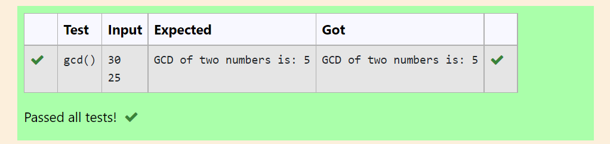

# Find the GCD of two numbers

## AIM:
To write a program to find the GCD of two numbers using function.

## Equipments Required:
1. Hardware – PCs
2. Anaconda – Python 3.7 Installation / Moodle-Code Runner

## Algorithm
1. Define a function
2. Get the two number from the user.
3. compare the leat value to ## Result:
Thus the program to find the maximum of given numbers from the list is written and verified using python programming. 

## Program:
```
/*
Program to find the gcd of two number using function.
Developed by:logeshwari.p 
RegisterNumber: 212221230055 
*/
```
def gcd():
    n1=int(input())
    n2=int(input())
    if(n1>n2):
        smaller=n2
    else:
        smaller=n1
    for i in range(1,smaller+1):
        if(n1%i==0 and n2%i==0):
            gcd=i
    print("GCD of two numbers is:",gcd)


## Output:



## Result:
Thus the program to find the GCD of two numbers is written and verified using python programming.
